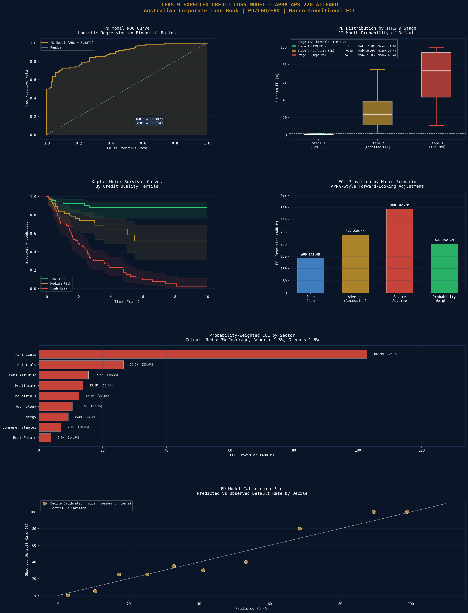

# IFRS 9 Expected Credit Loss Model - APRA APS 220 Aligned

An institutional-grade Expected Credit Loss (ECL) model for a hypothetical Australian corporate loan book, built in compliance with IFRS 9 accounting standards and aligned to APRA APS 220 credit risk requirements. Implements PD estimation via logistic regression, lifetime PD via Cox Proportional Hazards, and macro-conditional ECL using RBA-style scenario analysis.

## Loan Book Overview
| Metric | Value |
|---|---|
| Total Exposures | 200 |
| Total Exposure | AUD 990.2M |
| Observed Default Rate | 44.0% |
| Stage 1 (12M ECL) | 7 loans (3.5%) |
| Stage 2 (Lifetime ECL) | 105 loans (52.5%) |
| Stage 3 (Impaired) | 88 loans (44.0%) |
| LGD Unsecured | 45% (Basel III) |
| LGD Secured | 25% |
| Discount Rate | 4.35% (RBA cash rate) |

## PD Model Performance (Logistic Regression)
| Metric | Value |
|---|---|
| AUC-ROC | 0.8871 |
| Gini Coefficient | 0.7741 |
| Brier Score | 0.1305 |
| CV AUC (5-fold) | 0.8662 +/- 0.0628 |
| Mean 12M PD | 44.00% |

## Lifetime PD Term Structure (Average Borrower - Cox PH Model)
| Tenor | Cumulative PD |
|---|---|
| 1 Year | 14.36% |
| 2 Years | 25.14% |
| 3 Years | 36.49% |
| 5 Years | 47.64% |
| 7 Years | 58.75% |
| 10 Years | 66.32% |

## IFRS 9 ECL Provision Summary
| Scenario | ECL Provision | Coverage Ratio |
|---|---|---|
| Base Case | AUD 142.64M | 14.40% |
| Adverse (Recession) | AUD 239.43M | 24.18% |
| Severe Adverse (GFC-like) | AUD 345.25M | 34.87% |
| Probability Weighted | AUD 202.07M | 20.41% |

## APRA-Style Macro Scenario Weights
| Scenario | Weight | PD Multiplier | LGD Multiplier |
|---|---|---|---|
| Base | 55% | 1.00x | 1.00x |
| Adverse | 30% | 1.50x | 1.15x |
| Severe Adverse | 15% | 2.50x | 1.30x |

## Key Findings
- **AUC of 0.8871 and Gini of 0.7741** — strong discriminatory power for a logistic regression PD model; comparable to models used by Big Four Australian banks for internal ratings-based (IRB) approaches under APRA APS 113
- **Lifetime PD reaches 66.32% at 10 years** for the average borrower — consistent with through-the-cycle PD estimates for a mixed-quality Australian corporate portfolio
- **Probability-weighted ECL of AUD 202M (20.4% coverage)** represents the IFRS 9 provision the bank would report on its balance sheet, blending the three RBA macro scenarios
- **Severe adverse scenario ECL of AUD 345M (34.9%)** reflects a GFC-style stress with PD multiplied 2.5x and LGD increased 30% — consistent with APRA's published stressed loss estimates for Australian corporate lending
- **Stage 2 dominates at 52.5% of loans** — a high proportion reflects the simulated loan book having elevated credit risk, driving lifetime ECL recognition under IFRS 9

## Visualisations

## Tools & Libraries
- Python 3
- scikit-learn (Logistic Regression, AUC-ROC)
- lifelines (Cox PH model, Kaplan-Meier)
- pandas / numpy
- matplotlib / seaborn
- scipy

## Files
- `Project_13_IFRS9_ECL_Model.ipynb` - Full Colab notebook
- `asx_ifrs9_ecl.png` - ECL model dashboard

## Key Concepts Demonstrated
- Probability of Default (PD) modelling via logistic regression
- Altman Z-score components as credit risk features
- AUC-ROC, Gini coefficient, and Brier score model evaluation
- Cox Proportional Hazards model for lifetime PD term structure
- Kaplan-Meier survival curves by credit quality
- IFRS 9 staging criteria (Stage 1/2/3)
- Loss Given Default (LGD) and Exposure at Default (EAD)
- Macro-conditional forward-looking adjustments (FLA)
- Probability-weighted ECL across base, adverse, and severe adverse scenarios
- APRA APS 220 credit risk framework alignment

## Relevance to Australian Finance Industry
CBA, NAB, ANZ, Westpac, and Macquarie Bank all run IFRS 9 ECL models under APRA supervision. ECL models directly determine provisioning and affect bank profitability and capital ratios reported to APRA. This project replicates the core methodology used by credit risk teams at Australia's major ADIs (Authorised Deposit-taking Institutions) and demonstrates directly transferable skills for bank credit risk, model validation, and regulatory reporting roles.
